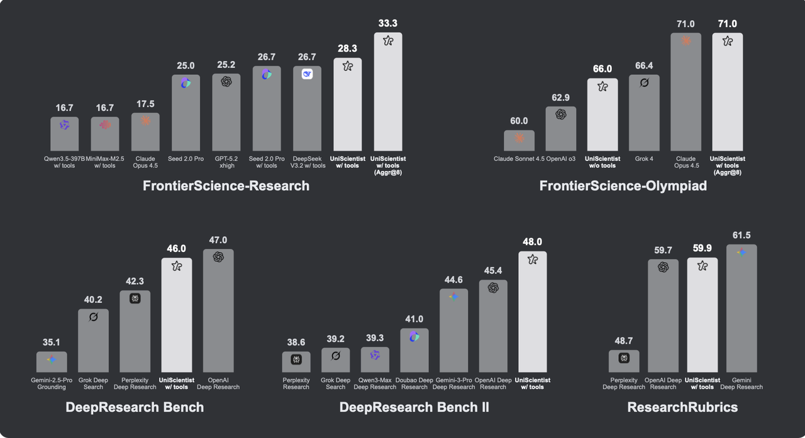
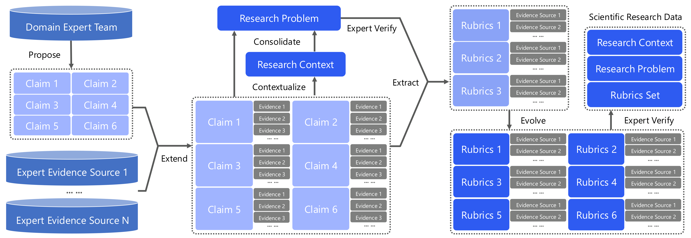
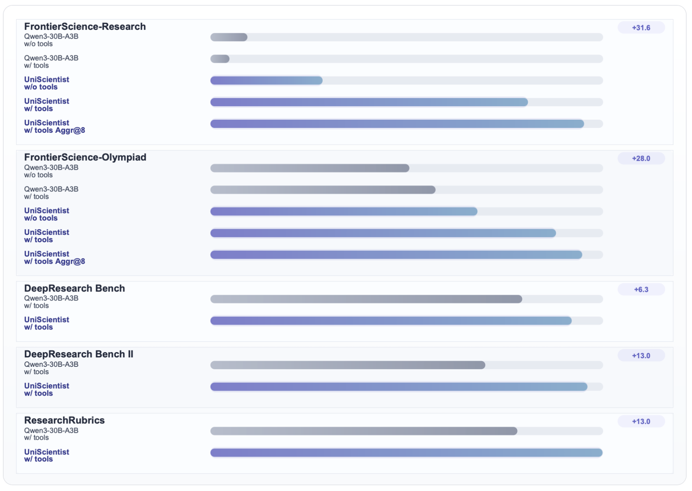

# UniScientist

<div align="center">
  <picture>
      
  </picture>
</div>


<div align="center" style="line-height: 1;">

[](https://huggingface.co/UnipatAI/UniScientist-30B-A3B)
[](https://github.com/UniPat-AI/UniScientist)
[](https://unipat.ai/blog/UniScientist)
<!-- []() -->

</div>

> *Advancing Universal Scientific Research Intelligence via Evolving Polymathic Synthesis*

### News
- **[2026-03-11]** We release the full inference trajectories of UniScientist on the FrontierScience-Research benchmark. Check the [`trajectory/`](./trajectory/) folder for details.

UniScientist advances universal scientific research intelligence through a unified paradigm. By reassigning LLMs as cross-disciplinary generators and human experts as high-precision verifiers, it produces research-grade data spanning **50+ scientific disciplines** with structured, rubric-based supervision. A 30B-parameter model trained on this data achieves highly competitive performance across five research benchmarks. Read the [blog](https://unipat.ai/blog/UniScientist) first for a better overall impression.

<div align="center">
  <picture>
      
  </picture>
</div>

## Overview

UniScientist formalizes open-ended scientific research as **Active Evidence Integration and Model Abduction**, and proposes the **Evolving Polymathic Synthesis** paradigm for synthesizing high-quality research problems and evaluation rubrics at scale.

The approach comprises three key components:

1. **Evolving Polymathic Synthesis** — A human-LLM collaborative data paradigm that generates research-grade scientific problems across 50+ disciplines, each accompanied by co-evolved rubrics refined through completeness, consistency, and distinguishability checks.
2. **Agentic Research Loop** — The model conducts scientific research by iteratively acquiring evidence, deriving formally-justified results, and updating hypotheses via abductive inference, using tools including `web_search`, `google_scholar`, `page_fetching`, and `code_interpreter`.
3. **Report Aggregation** — Given multiple candidate research reports, the model learns to synthesize a consolidated report integrating the best elements, enabling research quality to self-evolve over time.

<div align="center">
  <picture>
      
  </picture>
</div>

## Main Results

UniScientist-30B-A3B achieves top-tier performance across all five benchmarks, surpassing much larger proprietary models:

- **FrontierScience-Research**: **28.3** (surpassing Claude Opus 4.5 at 17.5, GPT-5.2 at 25.2), reaching **33.3** with test-time scaling (Aggr@8)
- **FrontierScience-Olympiad**: **66.0** without tools, **71.0** with tools + Aggr@8 (matching Claude Opus 4.5)
- **DeepResearch Bench**: **46.0** (vs. Perplexity Deep Research 42.3, OpenAI Deep Research 47.0)
- **DeepResearch Bench II**: **48.0** (surpassing OpenAI Deep Research 45.4, Gemini-3-Pro Deep Research 44.6)
- **ResearchRubrics**: **59.9** (comparable to OpenAI Deep Research 59.7, Gemini Deep Research 61.5)

<div align="center">
  <picture>
      
  </picture>
</div>

## Repository Structure

```
UniScientist/
├── local_deploy.sh                 # Step 1: Deploy local LLM via vLLM
├── inference_local_qwen.sh         # Step 2: Run agentic inference (repeat for multiple rollouts)
├── inference_local_qwen.py         # Agentic inference engine
├── inference_local_aggregate.py    # Step 3: Aggregate multiple rollouts into a final report
├── tools/
│   ├── tool_search.py              # Google web search (via Serper API)
│   ├── tool_scholar.py             # Google Scholar search (via Serper API)
│   ├── tool_visit.py               # Webpage reader (via Jina Reader API) with LLM summarization
│   └── tool_code.py                # Python code interpreter
├── trajectory/
│   ├── uniscientist_research_traj.jsonl          # Single-rollout trajectories (with tools)
│   ├── uniscientist_research_no_tool_traj.jsonl  # Single-rollout trajectories (without tools)
│   └── uniscientist_research_aggregate8_traj.jsonl # Aggregated trajectories (Aggr@8)
├── data/                           # Place your input data here (see Data Format below)
├── requirements.txt
└── .gitignore
```

## Quick Start

### Install

```bash
pip install -r requirements.txt
```

### Step 1: Deploy Local LLM

Edit `local_deploy.sh` to set `MODEL_PATH` to your model weights, then:

```bash
bash local_deploy.sh
```

This starts a vLLM OpenAI-compatible server on port 8000. Wait until the server is ready before proceeding.

### Step 2: Run Agentic Inference

Edit `inference_local_qwen.sh` to fill in your API keys and configuration, then run it **multiple times** to collect diverse rollouts:

```bash
# Run N times to collect N rollouts
bash inference_local_qwen.sh
bash inference_local_qwen.sh
bash inference_local_qwen.sh
```

Each run produces (or appends to) a `.jsonl` output file named `<STORED_MODEL_NAME>_<BENCHMARK>.jsonl`.

### Step 3: Aggregate Results

Merge multiple rollout results into a single comprehensive report:

```bash
python inference_local_aggregate.py \
    --model-name "UniScientist-30B-A3B" \
    --data-paths rollout_1.jsonl rollout_2.jsonl rollout_3.jsonl \
    --benchmark research \
    --rollout-num 1 \
    --llm-max-concurrency 32
```

## Configuration

### API Keys

The following API keys are required for the tool suite:

| Key | Service | Description |
|-----|---------|-------------|
| `SERPER_KEY_ID` | [Serper](https://serper.dev/) | Google web search & Google Scholar |
| `JINA_API_KEYS` | [Jina Reader](https://jina.ai/reader/) | Webpage content reading |
| `OPENROUTER_API_KEY` | [OpenRouter](https://openrouter.ai/) | LLM-based webpage summarization |

### Data Format

Place your input data in the `data/` directory as `.jsonl` files:

```json
{"problem": "Your research question here", "answer": "Ground truth answer / rubrics (optional)"}
```

### Aggregation Arguments

| Argument | Required | Default | Description |
|----------|----------|---------|-------------|
| `--model-name` | Yes | - | Model identifier for naming the output file |
| `--data-paths` | Yes | - | One or more rollout `.jsonl` files to aggregate |
| `--benchmark` | No | `research` | Benchmark name for naming the output file |
| `--rollout-num` | No | `1` | Number of aggregation passes per question cluster |
| `--local-base-url` | No | `http://localhost:8000/v1` | vLLM server endpoint |
| `--output-path` | No | auto-generated | Custom output file path |
| `--llm-max-concurrency` | No | `32` | Max concurrent LLM requests |


## Citation

If you find UniScientist useful in your research, please cite:

```bibtex
@misc{unipat2026uniscientist,
  title   = {UniScientist: Advancing Universal Scientific Research Intelligence},
  author  = {Baixuan Li and Jialong Wu and Yida Zhao and Wendong Xu and Xuanzhong Chen and Huifeng Yin and Liang Chen and Wentao Zhang and Kuan Li},
  year    = {2026},
  url     = {https://unipat.ai/blog/UniScientist}
}
```

## Contact

We are continuously expanding the Universal Scientific Research Dataset to cover additional disciplines and research paradigms. We welcome collaborations with research teams interested in advancing scientific research intelligence. Reach out at contact@unipat.ai.
